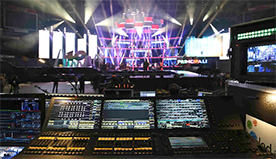

# ¿Qué hace un Técnico de Iluminación? 

Un técnicos de iluminación es el responsable de preparar, cablear, hacer funcionar y realizar el mantenimiento de los sistemas de iluminación y efectos eléctricos en una actuación teatral o artística.

Alguno de los requisitos que se pide para ser técnicos de iluminación son:
- Conocimiento técnico de electricidad y electrónica.
- Conocimiento de las posibilidades de las diferentes clases de equipos de luminotecnia.
- Prestar atención a los detalles y comprender los requisitos de prevención de riesgos laborales.
- Buenas habilidades de comunicación e interpersonales.
- Trabajar bien en equipo y a solas.
- Saber organizarse y trabajar bien bajo presión.
- Ser capaz de reaccionar rápidamente y de forma creativa ante todo problema que se plantee.
- Ser capaz de trabajar a deshoras.
- Paciencia, concentración y atención.

Los técnicos de iluminación trabajan en estrecha colaboración con los diseñadores, que son los que deciden dónde hay que colocar la iluminación y dibujan su posición sobre un plano. Usando este plano, los técnicos de iluminación instalan las luces y las enfocan para su correcto funcionamiento. 

       

Todo el equipo de iluminación se controla desde una mesa de control de iluminación. La mayoria de las mesas están informatizadas, por lo cual los técnicos de iluminación deben saber programar con ellas para llevar a cabo un espectáculo.

Durante los ensayos, los técnicos de iluminación ayudan a los diseñadores a crear efectos con la iluminación, creando diferentes escenas dependiendo el tipo de espectáculo. Un diseñador no tiene por que saber manejar una mesa de control, por eso el técnico de iluminación forma una parte importante del show. 

Una vez que el montaje está ya en marcha, se aseguran de que las luces funcionen correctamente y reciban el mantenimiento correcto. 

Una vez está todo programado para la gira, en montajes itinerantes, los técnicos de iluminación configuran el equipo y comprueban que todo está en correcto funcionamiento. Y una vez terminado el espectáculo, por lo general, hay que desmontarlo al cabo de poco tiempo para dirigirse al nuevo destino del espectáculo.

Pulsando [aquí](https://youtu.be/wD8P2AXYyL0) se muestra una programación de una canción realizada por mi en un visualizador 3D.

>La luz es el primer elemento del diseño, sin ella no hay color, forma o textura. -  *Thomas E. Farin*

**Parte de código *Copiado del foro AW*:**
public class ClasePrincipal {

public static void main(String[] args) {

sentencia_1;

sentencia_2;

// ...

sentencia_N;

}

}
